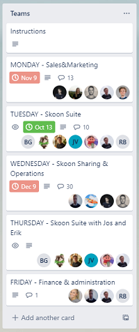
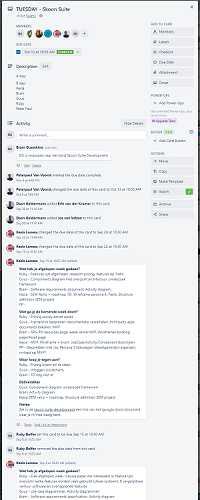

[*<< Terug naar leerdoelen*](../leerdoelen)

# Adviseren

**Leerdoel 4**: Ik wil na afloop van mijn stage in staat zijn om een werkwijze te adviseren binnen het bedrijf.

Ik heb in de eerste paar weken dat ik bij het bedrijf werkte gezien dat er geen vaste werkwijze is binnen het bedrijf. Hierbij gaat het dan vooral om hoe er om wordt gegaan met Trello of scrum. Ik heb me toen voorgenomen om hier verandering in te brengen. Ik heb toen aangegeven dat ik op school een andere manier had geleerd van het werken met Trello. Ik heb dit toen uitgelegd en dit is toen geïmplementeerd. Hieronder zal in het kort worden uitgelegd hoe dit in zijn werk gaat en wat er precies veranderd is.

### Before

In het begin hadden we een Trello bord die redelijk statisch was en waar er maar 1 kaartje per team ongeveer was. Alle informatie die uit meetings kwam werd in dat kaartje gezet in de comments section. Dit betekent dat als je iets wil hebben wat vorige week is gebeurd je moet terugscrollen naar die comment. Dit wordt heel snel onoverzichtelijk en worden afspraken snel vergeten.

